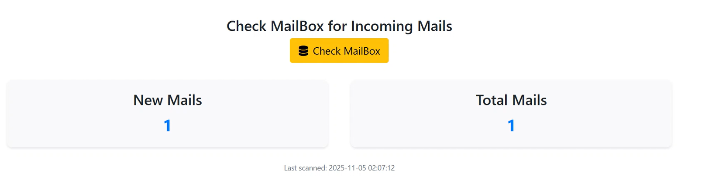
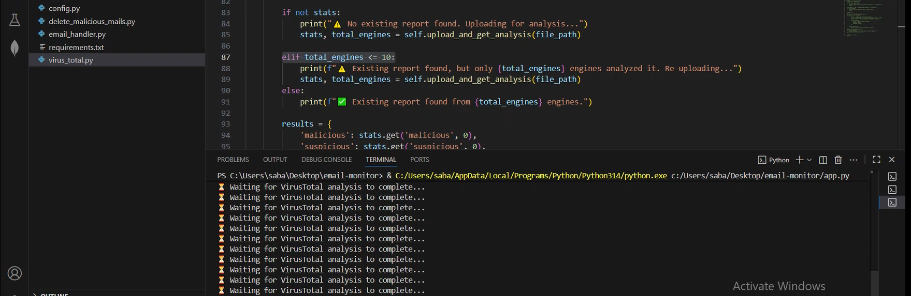
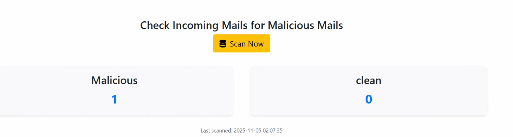
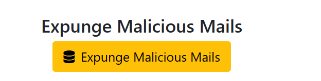

# Malicious Email Monitoring System
A Flask-based web application that automatically monitors your email inbox, scans attachments and content using VirusTotal API, and helps manage malicious emails efficiently.

# Overview

This system provides a comprehensive solution for email security by:
**Monitoring** your IMAP email inbox in real-time
**Scanning** emails and attachments using VirusTotal's multi-engine threat detection
**Identifying** malicious content with detailed analysis reports
**Managing** suspicious emails with secure deletion capabilities

**Providing** a clean web dashboard for monitoring and control

The **Automated Competitor Price Tracking** system is a tool designed to monitor and compare product prices across multiple competitor websites automatically. It helps businesses stay competitive by gathering real-time pricing data and generating insights for pricing strategy optimization.

## Features

**Real-time Email Monitoring** - Continuously checks for new incoming emails
**VirusTotal Integration** - Scans emails using 70+ antivirus engines
**Scan Analytics** -  Report on malicious vs clean emails
**Visual Dashboard** - Clean web interface showing scan statistics and results
**Safe Email Management** - One-click deletion of malicious emails
**Secure Configuration** - Environment-based configuration management


## Quick Start

Make sure **Python** is installed in your environment.

###  Clone the Git Repository
```bash
git clone https://github.com/sabasabafaraz789/malicious-email-monitoring.git
```

###  Navigate to the Project Directory
```bash
cd email-monitor
```

### Configure Environment Variables
Update a ```bash .env ``` file with your credentials:
```bash
EMAIL_USERNAME=your-email@gmail.com
EMAIL_PASSWORD=your-app-password
# VirusTotal Configuration
VIRUSTOTAL_API_KEY=your-virustotal-api-key
```

###  Install Required Dependencies
```bash
pip install -r requirements.txt
```

###  Run the Project
```bash
python app.py 
```

###  Open the Project in Your Browser
```bash
Visit:

http://127.0.0.1:8000/
```

## 💻 How to Use

1. On the front-end page, in "Check MailBox for Incoming Mails" section click “Check MailBox”. <br><br>


2. After checking mailbox  in "Check Incoming Mails for Malicious Mails" section click “Scan Now”.<br><br>
3. The analysis will start.....<br><br>




4. If you got any malicious mail then click on "Expunge Malicious Mails":<br><br>



## 👨‍💻 Author
Developed by **Saba Faraz**  
📧 Email: farazsaba96@gmail.com

---
